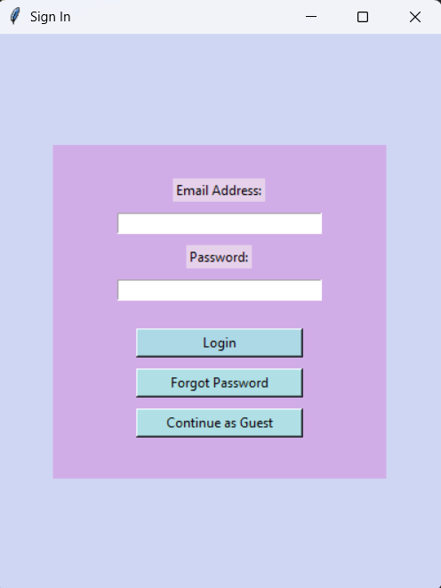

#  E-Commerce Login Interface (GUI)

This project is a modern login screen simulation designed for an online shopping platform. The color palette and layout have been crafted with a Focus on User Experience (UX), inspired by a clothing store concept.

##  Key Features
- **Modern UI:** Customized `Tkinter` interface with a pastel color theme.
- **Flexible Login Options:** Secure login for registered users, password reset simulation, and "Continue as Guest" functionality.
- **User Feedback:** Real-time notifications using `messagebox` for input validation and errors.
- **Security:** Password masking (`show="*"`) implemented for privacy.

---

##  Application Preview

---

##  Technical Overview
- **Library:** Python `Tkinter`
- **Architecture:** Organized using `Frame` widgets and `relx/rely` positioning for a responsive-like feel.
- **Validation Logic:** Built with Python's `if-elif-else` structures to handle various login scenarios.

##  About
This project was developed by a **Computer Engineering student at Beykent University** (Freshman year) to demonstrate GUI design fundamentals and software development documentation skills.
